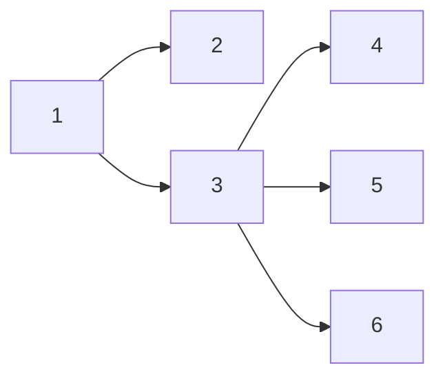
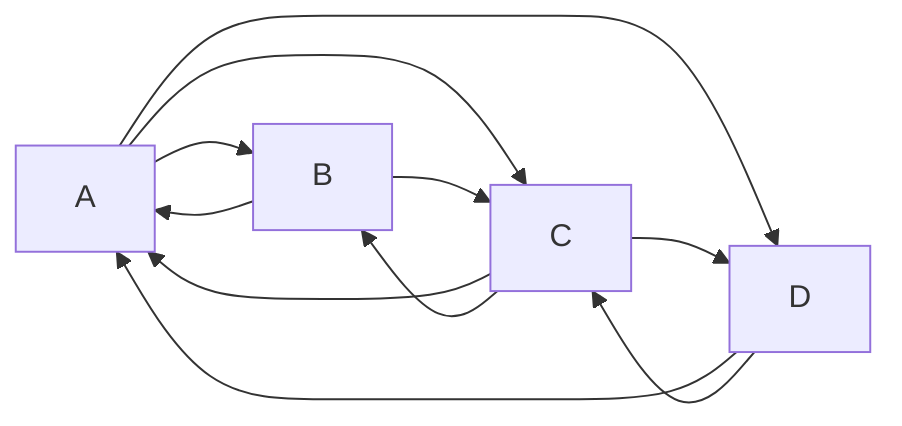

# Nodo con el mayor número de vecinos.
Este código recibe un grafo en forma de un diccionario y nos indica cual es el nodo con el mayor número de vecinos.
Si el número de nodos con el mayor número de vecinos es mayor a uno, el programa elegirá de manera aleatoria uno de esos nodos.

## Ejemplo
Supongamos el siguiente grafo:


Este grafo se representa como diccionario en Python de la siguiente forma:
```
grafo = {
    1: [2, 3],
    2: [],
    3: [4, 5, 6],
    4: [],
    5: [],
    6: []
}
```
El nodo con el mayor número de vecinos es el 3. Por lo tanto, el programa nos arrojará el resultado.

Otro ejemplo podría ser:
```
grafo = {
    'A': ['B', 'C', 'D'],
    'B': ['A', 'C'],
    'C': ['A', 'B', 'D'],
    'D': ['A', 'C']
}
```
Su grafo sería:

En este caso `A` y `C` tienen el mismo número de vecinos. Por ende, el programa nos arrojará `A` o `C` como resultado.
